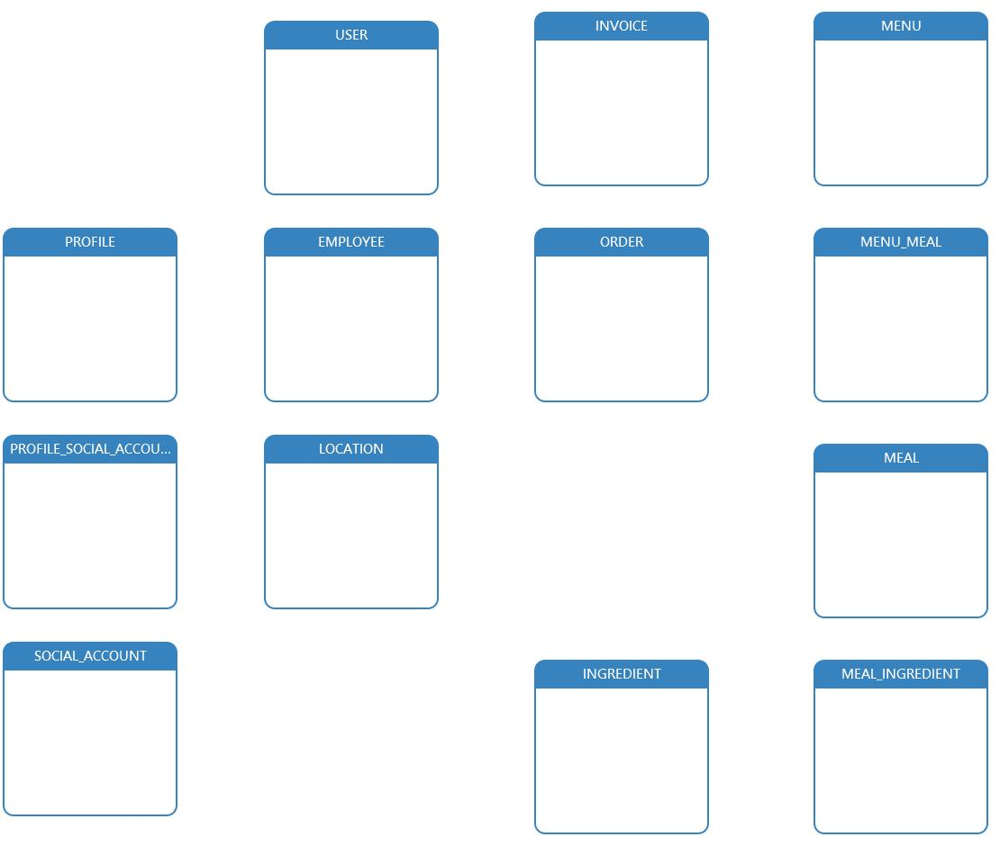
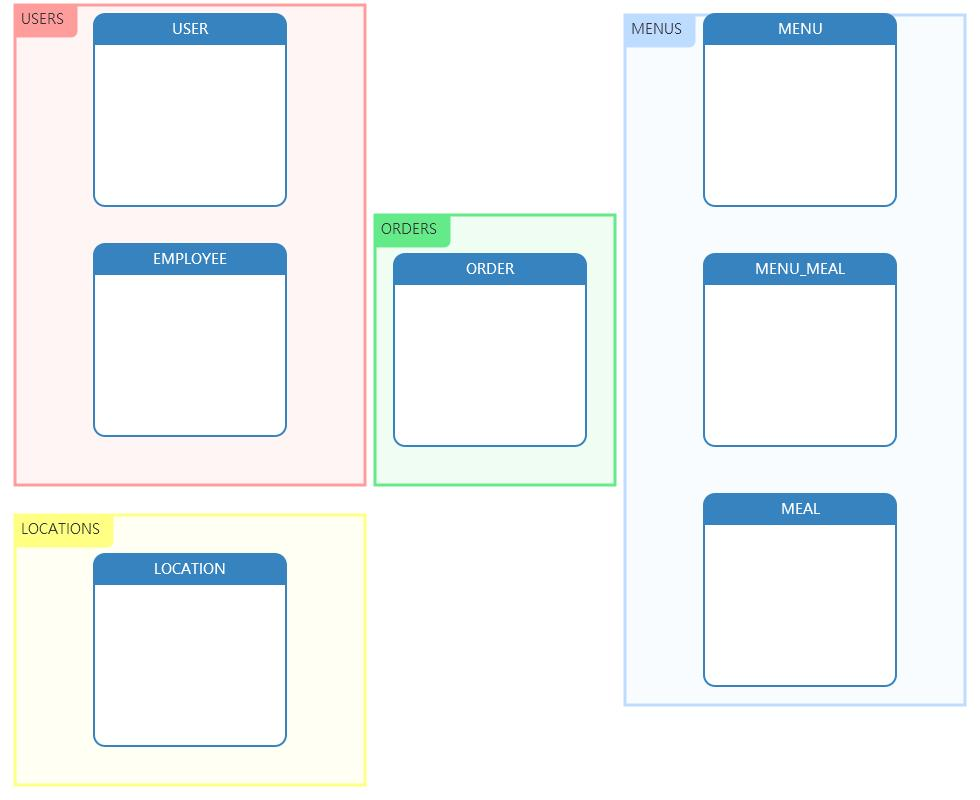
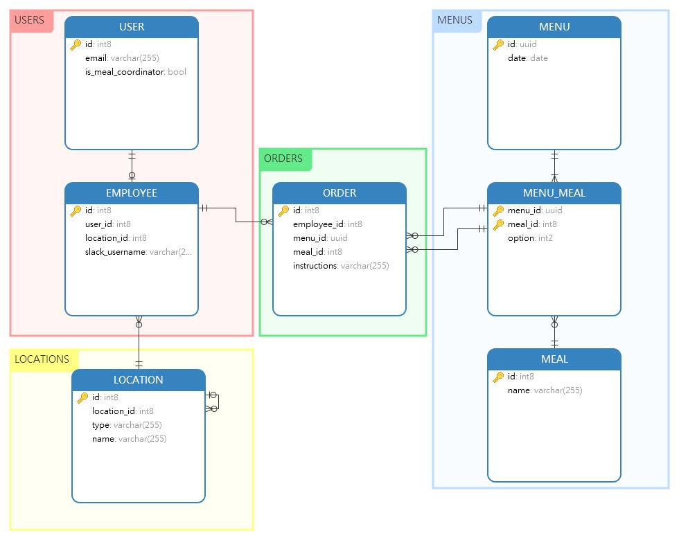
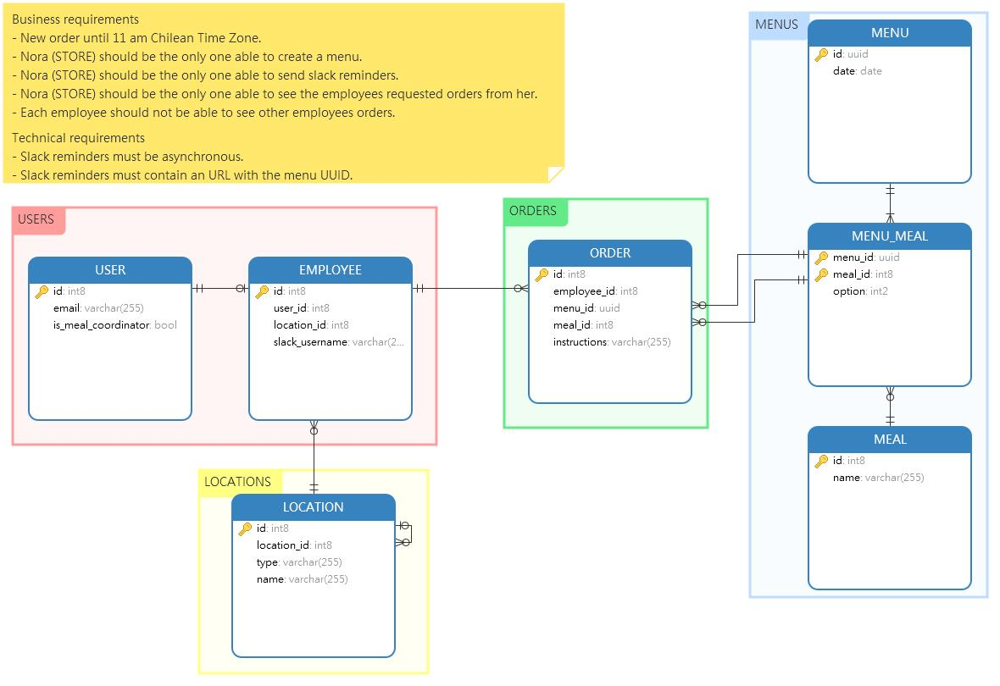

# Test solution explanation

## 1. - Spike

I had to analyze the problem in a technical context because I did not know how to send a slack reminder. I had to check out Django documentation and some more websites to remember some good practices in Django.

## 2. - Design the solution

I like to model the entities or the objects in a diagram for this reason I have choose a conceptual database diagram called entity relationship.

First, I did a brainstorm to settle every idea of entity I have read in the problem. 

Second, I try to delimit the problem because I had a couple of years without programming in Django.

Third, I know the best way to design a entity relationship is normalizing, but that implies more code and more time so I have prefer to desnormalize some entities to focus on the problem and advance a little bit faster. If I finish the test before the deadline I would do some refactoring and normalize more entities. 

Fourth, I have grouped the entities in feature modules.

Then, I wrote business and technical requirements.

## 3. - Configuring local development environment

I added vscode settings to work more comfortable.

## 4. - From model to code